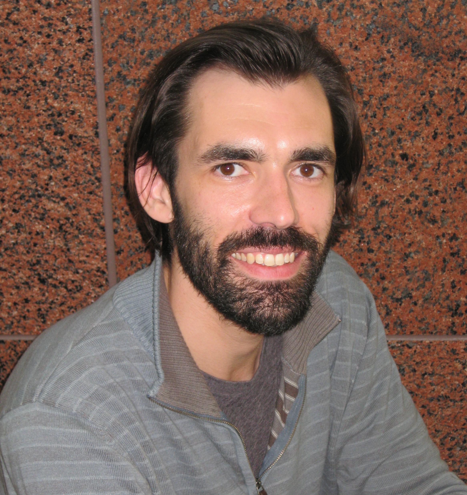

<script type="text/x-mathjax-config">
  MathJax.Hub.Config({ TeX: { equationNumbers: {autoNumber: "all"} } });
</script>

```{r setup, include=FALSE}
knitr::opts_chunk$set(echo = TRUE)
```

<!-- NOTE: Setting up webpage using Rmarkdown. Going by section... -->
<br>
<br>

<br>
<br>

<!-- <p style="font-family:Times"> -->
<p style="font-size: 18px">
   &ensp; Research Scientist II, [Weitz Lab](https://weitzgroup.biosci.gatech.edu/) <br>
   &ensp; Biological Sciences <br>
   &ensp; Georgia Tech, Atlanta, GA 
</p>
<br>

---

<br>
<br>

## About

<br>
<p style="font-size: 24px">
Broadly, I use math models to study biological systems. In my PhD, I studied spatiotemporal patterns in neural firing rate models, advised by [Professor Bard Ermentrout](https://sites.pitt.edu/~phase/). During my postdoc'ing, I transitioned to studying virus-host dynamics across scales & systems. <br>

I am currently in the [Weitz lab](https://weitzgroup.biosci.gatech.edu/) at GA Tech in biological sciences. I did my first postdoc in biology at Emory University, supervised by [Professor Katia Koelle](https://scholarblogs.emory.edu/koellelab/group-members/) (2017-2020) after receiving my PhD in applied math at University of Pittsburgh (2017). <br>

 <br>
</p>


#### Weblinks <br>
- [here is my github - trying to use actively!](https://github.com/Jeremy-D-Harris/)
- [linkedin page - not using actively :( ](https://www.linkedin.com/in/jeremy-d-harris)
- [orcid](https://orcid.org/0000-0002-6836-3620)
<!-- - [linkedin](https://www.linkedin.com/in/jeremy-d-harris) -->
<br>
<br>


---

<br>
<br>

## Research
<br>
<p>
I use math models to study the ecology and evolution of infectious diseases. Infectious diseases occur often occur across multiple scales. For instance, in epidemics models there is the individual level, where transmission is often quantified by the reproduction number, $R_0$ ("strength") and the population level, where transmission is quantifed by the observed exponential growth rate of new cases, "$r$" ("speed"). Hence, models can be used to bridge these scales, telling us about <em>hidden variables </em> from those observed. 
</p>
<br>

<!-- ### In the [Weitz Lab](https://weitzgroup.biosci.gatech.edu/) <br> -->
#### Weitz Lab (2020-Present) <br>
<!-- <details closed> -->
<p>
- <b> epidemic models </b>
  <details closed>
  - asymptomatic transmission in COVID-19 using a generation interval framework <br>
  - effects of variation in transmissibility and susceptibility <br>
  </summary>
- <b> virus-microbe dynamics and entanglement problems </b>
  - latent period variability in one-step experiments
  - multiple phages form lysogens on a shared host $\rightarrow$ complex dynamics
  - cellular responses to different bulk MOI show alternative modes of infection, e.g., lysis inhibition, pseudolysogeny 
</p>
<!-- </summary> -->
<br>

<!-- ### In the [Koelle lab](https://scholarblogs.emory.edu/koellelab/) <br> -->
#### Koelle lab (2017-2020) <br>
<!-- to make a collapsible section -->
<!-- <details closed> -->
<p>
- modeling cellular responses to multiple infections in influenza
- emergent population dynamics
</p>
<!-- </summary> -->
<br>
<br>
<br>
<br>

\newpage 

---

<br>
<br>

## Teaching
<br>
<p>
- [QBioS Foundations Course](https://qbios.gatech.edu/course-information) (Fall 2021 & 2022) <br>
- [ICTP-SAIFR Training Program in Quantitative Biology and Ecology](https://www.ictp-saifr.org/qbioprogram/) (Summer 2022)
</p>
<br>
<br>
